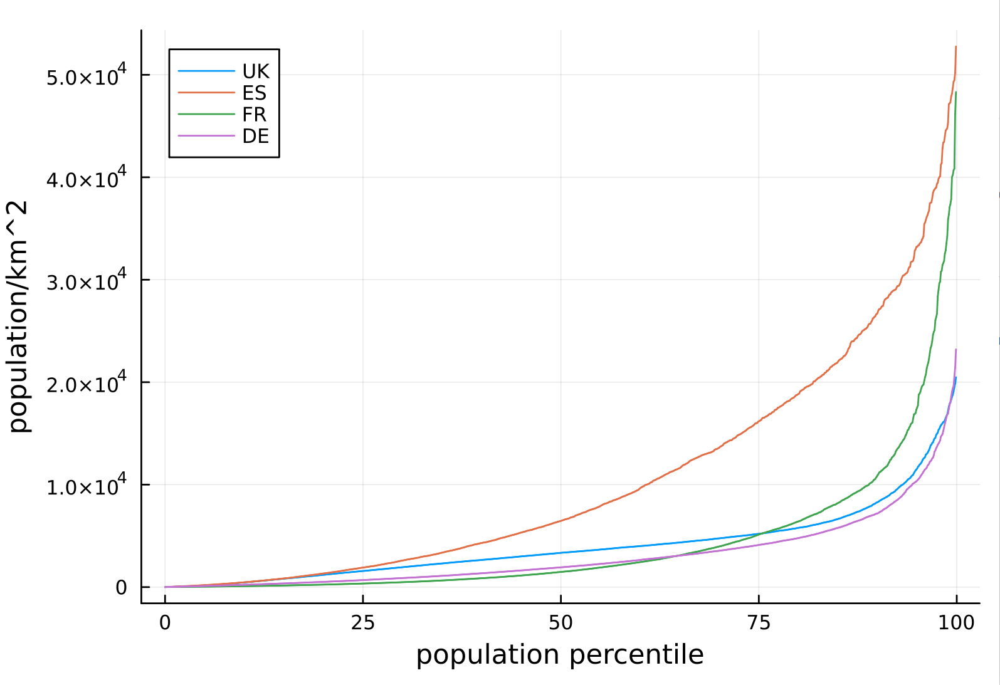
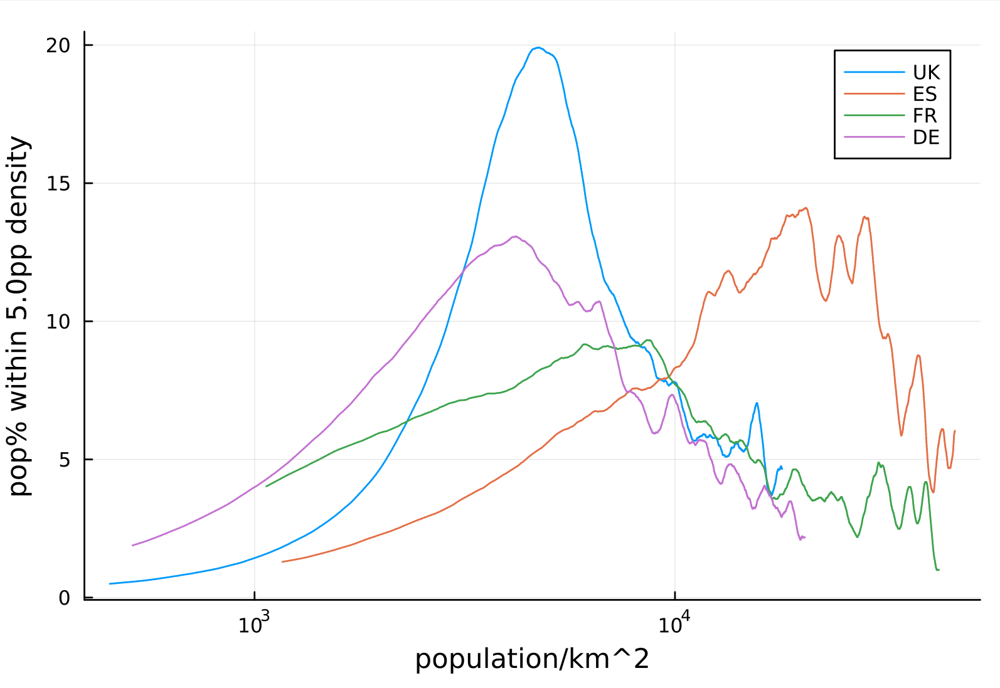

# manifesto

population density is usually measured really badly, just population of country / the size of the country

using geostat - https://ec.europa.eu/eurostat/web/gisco/geodata/reference-data/population-distribution-demography/geostat - we can look at the population density at the km^2 level and use that to look at the median population density, that is, the population density as experienced by the median person in the country

# results

compare this with the headline figures you get if you look at just average population density across the entire countries

| country | population density | population density (median) | 25th - 75th percentile |
| --- | --- | --- | --- |
| UK | 281 | 3,338 | 1,567 - 5,192 |
| Spain | 94 | 6,430 | 1,894 - 16,136 | 
| France | 119 | 1,473 | 345 - 5,104 |
| Germany | 240 | 1,922 | 680 - 4,098 |

# notable points

- the UK has very uniform population density at the kind of "town" level of about 7,000 people per km^2
- Germany is similar to the UK but has a wider distribution, with the densest cities being slightly denser than the UK
- the UK has one big peak corresponding to London
- Spain is extremely densely populated
- France has some very densely populated cities but also lots of people living in sparsely populated areas

# questions

- I would like to know why France has a big turning point at 10,000 people per km^2
- The UK is presumably bunched up around the 7,000 people per km^2 mark because of highly centralised planning laws
- Why does Spain have a big turning point just after 10,000 people per km^2? Is it to do with the heat?
- Why are Germany and the UK so similar? Is it because of the same planning laws?
